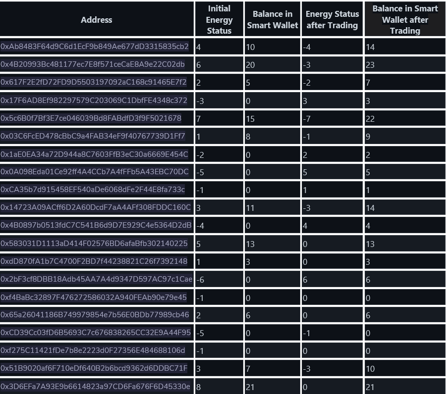

# Blockchain-P2P-Energy-Trading

The incentive mechanism in the P2P contract is designed to encourage prosumers to participate in the energy trading market. It works by rewarding prosumers with a small percentage of the purchase price for each unit of energy they buy, and a larger percentage of the sale price for each unit of energy they sell. The rewards are calculated using a formula that takes into account the following factors:

- The price of energy.
- The amount of energy traded.
- The type of energy traded.
 
The incentive mechanism is implemented using a smart contract on the Ethereum blockchain. The smart contract stores all of the data related to energy trading, including the price of energy, the amount of energy traded, and the time and date of the trade. The smart contract also calculates the rewards for each prosumer and distributes the rewards to the prosumers' wallets.

The incentive mechanism is designed to be fair and equitable to all participants in the energy trading market. It is also designed to be sustainable, so that the market can continue to operate in the long term.

In simple terms, the moto of incentive mechanism is to encourage user engagement.

Below is the image that contains the table of the various tests done though the code's is little broken. 🧶

